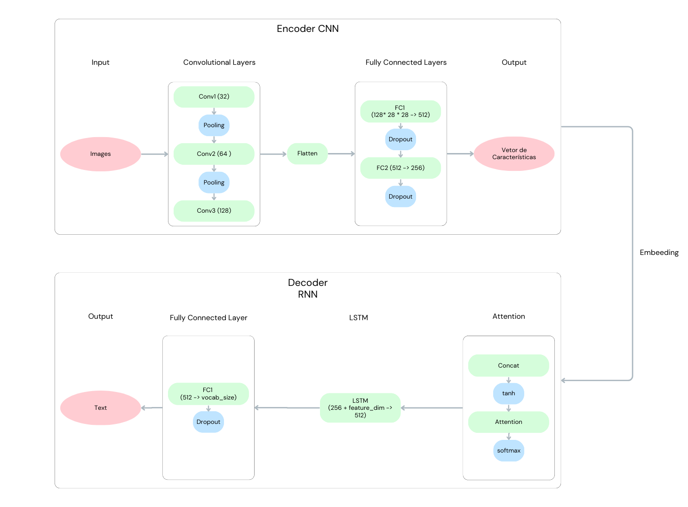
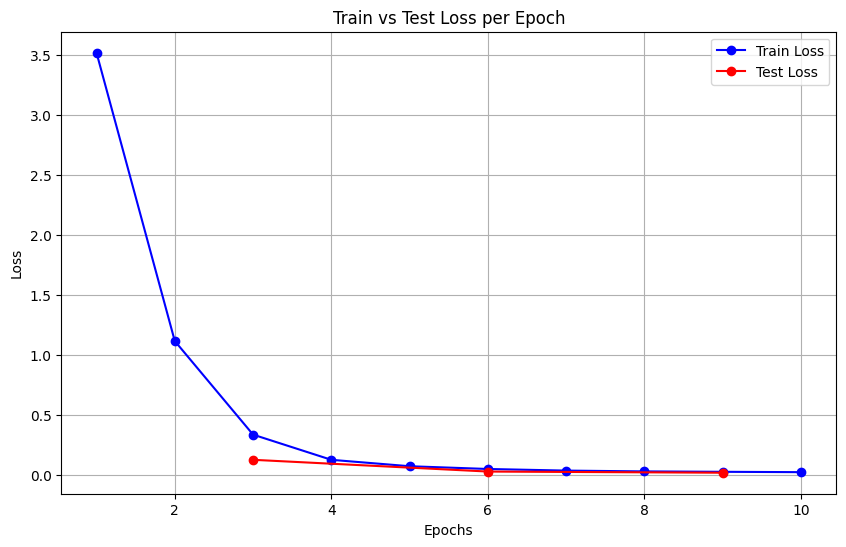
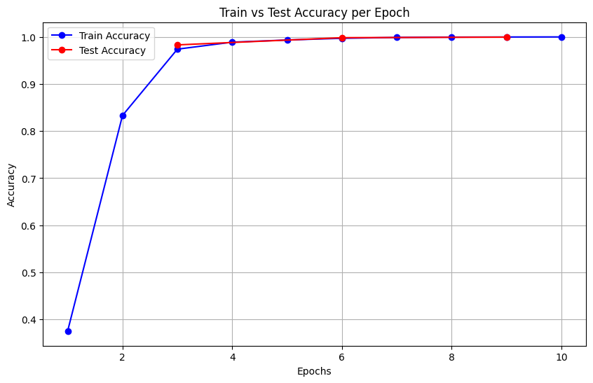
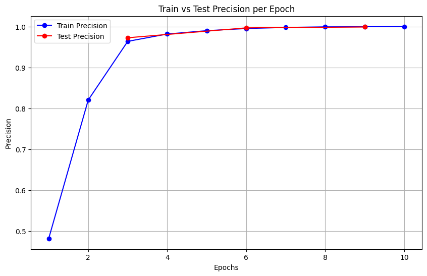

# Projeto Final - Introdução ao Aprendizado Profundo

## 1. Problema Abordado: Image to Text

O problema abordado neste projeto é a geração de legendas (captioning) para imagens, conhecido como Image to Text. Esse problema consiste em desenvolver um modelo capaz de analisar o conteúdo de uma imagem e gerar uma descrição textual que capture as principais características e elementos presentes na imagem.

A geração de legendas a partir de imagens é uma tarefa com aplicações extremamente importantes em diversas áreas. Essa tecnologia permite que pessoas cegas ou com baixa visão possam entender e interagir com o mundo visual, através de descrições de imagens geradas automaticamente. Além disso, o image captioning também é usado na área da saúde, analisando imagens e proporcionando descrições que podem auxiliar os médicos a identificarem anomalias em exames.

O principal desafio associado à tarefa de Image to Text é a combinação de processamento de imagem com geração de linguagem natural. O modelo, além de conseguir compreender o conteúdo visual da imagem, deve ser capaz de gerar uma descrição textual coerente e precisa.

## 2. Rede Implementada: Attention-based LSTM

A arquitetura descrita para a tarefa de Image-to-Text combina uma rede convolucional (CNN) com um decodificador baseado em atenção e LSTM (Long Short-Term Memory).

O Encoder CNN extrai características das imagens através de três camadas convolucionais (Conv2d) com 32, 64 e 128 filtros, respectivamente, cada uma seguida por uma camada de ativação ReLU e uma camada de MaxPooling (reduzindo a dimensionalidade pela metade).As saídas são achatadas e passadas por duas camadas totalmente conectadas (512 e 256 neurônios), com Dropout de 50% aplicado para regularização. Gerando por fim um vetor de características de dimensão 256.

A camada de Atenção calcula o vetor de contexto, pesando as características extraídas da imagem de acordo com o estado oculto do LSTM. Ela é composta por uma camada linear para combinar as características da imagem e o estado oculto. Uma segunda camada linear que gera os pesos de atenção, seguidos por uma operação de Softmax para normalização. Tem como saída um vetor de contexto ponderado, utilizado pelo decodificador.

Por fim, o Decoder RNN com Atenção gera a sequência textual baseada nas características da imagem e no vetor de contexto gerado pela atenção. É composta por um embedding que mapeia as palavras das legendas em vetores densos, seguida de uma LSTM que recebe como entrada os vetores de embedding concatenados com o vetor de contexto da atenção. Por fim, uma camada totalmente conectada (Linear) que mapeia a saída do LSTM para o espaço do vocabulário, tendo como saída uma sequência de palavras que formam a legenda da imagem.

## 3. Conjunto de Dados

O [Bento800](https://github.com/Yutong-Zhou-cv/Bento800_Dataset) é um conjunto de dados sintético e manualmente anotado com apresentações estéticas de marmitas ("bento"). Ele é composto por 800 imagens de marmitas, cada uma com uma resolução de 600x600 pixels. As imagens são geradas a partir de 34 imagens individuais de alimentos, organizadas em 6 categorias:

* Arroz 🍚 (10)
* Frango Frito 🍗 (5)
* Salmão Grelhado com Sal 🐟 (5)
* Tamagoyaki 🧈 (6)
* Croquete 🍪 (5)
* Camarão Frito 🍤 (3)

Esses alimentos são apresentados em três tipos diferentes de combinações:

* Colocação do frango frito sobre o arroz;
* Colocação do salmão grelhado com sal e tamagoyaki sobre o arroz;
* Colocação do croquete e do camarão frito sobre o arroz, onde o camarão frito é colocado sobre o croquete.
  
O conjunto de dados Bento800 é dividido em conjuntos de treino e teste, com 766 para treino e 35 para teste. Para cada imagem, existem 9 descrições textuais associadas, totalizando 254 palavras distintas, que ajudam na tarefa de geração de legendas automáticas para as imagens.

## 4. Treinamento da Rede

Nesse projeto, o algoritmo de otimização utilizado para o treinamento da rede foi o Adam. Este é um dos otimizadores mais populares para treinamento de redes neurais, e combina dois outros métodos de otimização: AdaGrad e o RMSProp.

Os parâmetros com maiores gradientes recebem uma redução na taxa de aprendizado, e os menores mantêm uma maior taxa de aprendizado. Essa é uma característica herdada do AdaGrad, que acumula o quadrado dos gradientes anteriores, ajustando a taxa de aprendizado adaptativamente. Enquanto isso, o RMSProp faz o mesmo, mas evita o problema de um desaparecimento da taxa de aprendizado que pode ocorrer no algoritmo anterior. Uma vez que o quadrado dos gradientes são aproveitados, ao passo que eles diminuem, o quadrado fica cada vez menor, até chegar ao ponto de serem arredondados para zero, encerrando o aprendizado. Para solucionar esse problema, o RMSProp utiliza a média móvel dos quadrados dos gradientes, controlando a variação das atualizações de cada parâmetro. A combinação desses dois pelo Adam vem com a divisão em duas ordens: Em um primeiro momento, o Adam mantém uma média móvel exponencial dos gradientes passados. Em seguida, ele também mantém a média móvel exponencial dos QUADRADOS dos gradientes. Semelhante ao que o RMSProp faz, mas com um ajuste que evita a redução excessiva de aprendizado.

No contexto do problema Image-To-Text baseado na arquitetura desenvolvida, o Adam fornece uma estabilidade no aprendizado, ou seja, no ajuste dos pesos. Isso ocorre pois, em uma RNN com atenção, o fluxo de gradientes pode variar muito. Além disso, como o Adam ajusta a taxa de aprendizado de cada parâmetro de forma independente, ele pode ajudar a evitar problemas de treinamento como a saturação de um peso para uma feature específica. Por fim, o Adam ainda contribui para a eficiência, ao passo que após o vetor de características de dimensão é gerado pelo Encoder CNN junto à complexa sequência textual processada pela RNN com mecanismo de atenção, o Adam colabora para um aprendizado eficiente ao lidar com gradientes de escalas distintas.

Com base em alguns testes e na busca por um melhor resultado, foi utilizada a seguinte configuração de hiperparâmetros: learning_rate = 0.0005 e weight_decay = 0.001. Uma vez que a taxa de aprendizado controla o passo do otimizador, é importante encontrar um valor que não pule estados interessantes, mas que também avance suficientemente à cada iteração. Com esse valor bastante standard, encontramos uma convergência estável, ao passo que o modelo faz atualizações menores, evitando oscilações no treinamento, o que é importante no caso dessa rede bastante complexa. Enquanto isso, valor de decaimento dos pesos é basicamente uma regularização L2, que adiciona um termo de pena aos pesos durante o treinamento, fundamental para o overfitting, ao forçar os pesos a se manterem pequenos. Aplicado ao nosso cenário, com um conjunto de dados não muito robusto, implementado em uma rede bastante complexa, é fundamental manter-se atento ao problema do overfitting. Dessa forma, a escolha desses dois parâmetros foi fundamental.

Também foi utilizada CrossEntropyLoss como função de perda. Por se tratar de um problema de classificação prevendo uma sequência de palavras, essa é uma função amplamente utilizada. Nesse caso, o hiperparâmetro utilizado foi o ignore_index=vocab['']. Isso ocorre, pois existem sequências de texto de comprimento variável no dataset, e o token de padding é usado para preencher as sequências mais curtas. Com isso, excluímos os tokens de padding da função de perda. Não penalizando a rede por prever incorretamente os tokens, já que não são palavras reais da legenda.

Por fim, foi também utilizado o clipping de gradientes. Utilizado para evitar que os gradientes se tornem muito grandes durante o treinamento. Durante o treinamento de redes que utilizam LSTMs, os gradientes podem crescer exponencialmente em sequências muito longas. O clipping limita o valor máximo dos gradientes, estabilizando o treinamento.

## 5. Qualidade dos Resultados

|  |  |  |
|----------|----------|----------|
|  |  |  |

O gráfico de loss durante o treino e teste mostram uma queda acentuada nas primeiras épocas, indicando que o modelo rapidamente aprendeu a minimizar o erro em ambas as fases. A partir da quarta época, tanto a loss de treino quanto a de teste se estabilizam em valores próximos de zero, sugerindo que o modelo atingiu um ponto de convergência muito rapidamente.

Os gráficos de acurácia e precisão durante o treino e teste mostra um rápido aumento nas primeiras épocas, com a acurácia e precisão de treino subindo de aproximadamente 40% para quase 100% já na segunda época. A partir daí, tanto a acurácia e precisão de treino quanto a de teste permanecem muito próximas de 100%.

Os resultados obtidos no modelo de Image to Text, apesar de apresentarem excelentes métricas de acurácia, loss e precisão, revelaram uma falha significativa na qualidade das descrições geradas. O modelo repetiu constantemente a mesma palavra em todas as predições, o que indica que ele pode estar sofrendo de "modo colapsado," onde o modelo aprende a maximizar as métricas apenas gerando saídas repetitivas ou padrões simples, sem realmente entender as relações complexas entre as imagens e as descrições textuais.

Isso pode ocorrer devido a diversos fatores, como problemas na arquitetura CNN e RNN qu podem levar à geração de descrições repetitivas devido à insuficiência na extração de características relevantes ou à má gestão do contexto sequencial. Se a CNN não extrair informações discriminativas das imagens, as features fornecidas à RNN serão pobres, limitando a capacidade do modelo de produzir descrições variadas. Além disso, se a RNN não conseguir manter o contexto adequado ao longo da sequência, ela pode acabar repetindo palavras, resultando em saídas monótonas e pouco informativas. Ajustes na profundidade da CNN e na capacidade de retenção da RNN podem ajudar a mitigar esse problema. Outro problema é a falta de diversidade e quantidade de dados no treinamento, que pode levar o modelo a generalizar inadequadamente, resultando em saídas repetitivas como a observada. Além disso, um conjunto de dados pequeno pode não fornecer exemplos suficientes para que o modelo aprenda a mapear corretamente as características das imagens para descrições variadas e precisas.

## 6. Discussão Geral

Neste trabalho, foi implementado um modelo de Image to Text com uma arquitetura baseada LSTM com mecanismo de atenção.

Um grande desafio encontrado durante o desenvolvimento do projeto, além de montar e implementar toda a arquitetura da rede neural, foi ter a capacidade de analisar os resultados e identificar quais as possíveis causas e problemas presentes em nosso projeto.

Os resultados obtidos a partir de nosso modelo de Image to Text não foram muito satisfatórios, visto que as legendas geradas pelo modelo apresentaram palavras repetitivas, que não capturaram o conteúdo das imagens. Acreditamos que a principal limitação que contribuiu para os resultados insatisfatórios foi o tamanho reduzido e a pouca variedade do dataset Bento800. As imagens e descrições do dataset são muito parecidas, diminuindo a quantidade de informação. Um conjunto de dados maior e mais diversificado poderia fornecer ao modelo uma base melhor para aprender as relações entre imagens e descrições textuais. No entanto, devido às limitações de recursos computacionais no Google Colab, não foi possível treinar o modelo em um dataset maior. Foram feitos testes com datasets maiores, porém o treinamento requeria mais tempo, e a execução era interrompida pelo Colab antes de finalizar.

O uso de uma rede neural pré treinada, como uma ResNet, para a parte de codificação de imagem, poderia ter melhorado significativamente os resultados. Essas redes, já treinadas em grandes volumes de dados, poderiam fornecer características visuais mais robustas e discriminativas, facilitando o processo de geração de legendas mais precisas e menos repetitivas. Apesar disso, neste projeto, optamos conscientemente por desenvolver e treinar nossa rede do zero, tendo como objetivo aprimorar nosso conhecimento prático e teórico, entendendo o processo e os desafios envolvidos em construir uma rede neural que fosse capaz de realizar a tarefa de image captioning.
